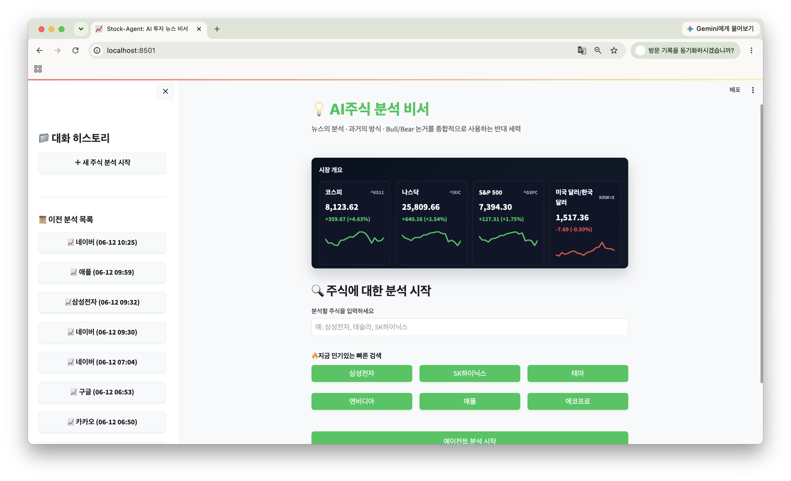

# Stock-Agent: AI 주식 뉴스 분석 비서

Stock-Agent는 사용자가 입력한 종목명 또는 선택한 인기 종목을 기반으로 관련 뉴스를 수집하고, AI 에이전트가 뉴스 감성 분석, 리스크 분석, 기술적 분석, 최종 브리핑을 제공하는 Streamlit 기반 주식 분석 서비스입니다.

본 프로젝트는 뉴스 기반 투자 판단 보조를 목표로 하며, 투자 결정을 대신하는 것이 아니라 사용자가 시장 흐름과 주요 리스크를 빠르게 파악할 수 있도록 돕는 AI 브리핑 도구입니다.

---

## 메인 화면

<p align="center">
  
</p>

---

## 주요 기능

### 1. 종목 뉴스 수집

사용자가 종목명을 입력하면 네이버 뉴스 API를 통해 관련 뉴스를 자동으로 수집합니다.

- 종목별 최신 뉴스 검색
- 뉴스 제목, 요약, 링크 수집
- 검색 결과 개수 설정 가능

### 2. 뉴스 감성 분석

수집된 뉴스 내용을 바탕으로 AI가 긍정, 부정, 중립 흐름을 분석합니다.

- 호재성 뉴스 판단
- 악재성 뉴스 판단
- 시장 심리 요약

### 3. 리스크 분석

뉴스에서 투자자가 주의해야 할 위험 요소를 추출합니다.

- 실적 악화 가능성
- 규제 및 정책 이슈
- 시장 변동성
- 기업 관련 부정 이슈

### 4. 종합 브리핑 생성

여러 분석 결과를 종합하여 사용자가 이해하기 쉬운 형태의 최종 브리핑을 제공합니다.

- 핵심 뉴스 요약
- 감성 분석 결과
- 주요 리스크
- 투자 판단 시 참고할 점

### 5. RAG 기반 검색 및 저장

ChromaDB를 활용하여 뉴스 및 분석 결과를 벡터 형태로 저장하고, 이전 분석 내용을 기반으로 추가 질의응답이 가능하도록 구성했습니다.

### 6. 이메일 리포트

설정된 이메일 계정을 통해 일일 주식 분석 리포트를 발송할 수 있습니다.

---

## 기술 스택

| 구분          | 사용 기술                           |
| ------------- | ----------------------------------- |
| Frontend / UI | Streamlit                           |
| Backend       | Python                              |
| News API      | Naver News API                      |
| LLM           | Ollama qwen2.5:7b, Gemini 1.5 Flash |
| RAG           | ChromaDB, Embedding                 |
| Email         | Gmail SMTP                          |
| Data Storage  | JSON, VectorDB                      |
| Environment   | `.env`                              |

---

## 프로젝트 구조

```txt
LLM_STOCK_BRIEFING_AGENT/
├── app.py                  # Streamlit 메인 실행 파일
├── ai_agent.py             # AI 분석 에이전트
├── news_agent.py           # 뉴스 수집 에이전트
├── summary_agent.py        # 뉴스 요약 에이전트
├── bull_bear_agent.py      # 긍정/부정 분석 에이전트
├── technical_agent.py      # 기술적 분석 에이전트
├── history_agent.py        # 과거 주가 기록 분석 에이전트
├── orchestrator.py         # 전체 에이전트 흐름 제어
├── rag_vector.py           # RAG 및 벡터 DB 처리
├── scheduled_report.py     # 이메일 리포트 스케줄링
├── utils.py                # 공통 유틸 함수
├── requirements.txt        # Python 패키지 목록
├── style.css               # UI 스타일
├── .env.example            # 환경변수 예시 파일
├── .gitignore              # Git 제외 파일 목록
└── README.md
```

---

## 설치 및 실행 방법

### 1. 저장소 클론

```bash
git clone https://github.com/사용자아이디/저장소이름.git
cd 저장소이름
```

---

### 2. 가상환경 생성 및 실행

#### macOS / Linux

```bash
python3 -m venv venv
source venv/bin/activate
```

#### Windows

```bash
python -m venv venv
venv\Scripts\activate
```

---

### 3. 패키지 설치

```bash
pip install -r requirements.txt
```

---

### 4. 환경변수 설정

`.env.example` 파일을 복사하여 `.env` 파일을 생성합니다.

```bash
cp .env.example .env
```

Windows에서는 직접 복사하거나 아래 명령어를 사용할 수 있습니다.

```bash
copy .env.example .env
```

그 후 `.env` 파일에 실제 API 키와 이메일 정보를 입력합니다.

```env
NAVER_CLIENT_ID=your_naver_client_id
NAVER_CLIENT_SECRET=your_naver_client_secret
NAVER_NEWS_API_URL=https://openapi.naver.com/v1/search/news.json

LLM_PROVIDER=ollama
OLLAMA_BASE_URL=http://localhost:11434
OLLAMA_MODEL=qwen2.5:7b
OLLAMA_TIMEOUT_SECONDS=900

GEMINI_API_KEY=your_gemini_api_key
GEMINI_MODEL=gemini-1.5-flash

OPENAI_API_KEY=your_openai_api_key

MOCK_MODE=false
NAVER_DISPLAY_COUNT=10
CORS_ORIGINS=http://localhost:5173,http://127.0.0.1:5173

EMAIL_HOST=smtp.gmail.com
EMAIL_PORT=587
EMAIL_USER=your_email@gmail.com
EMAIL_PASSWORD=your_gmail_app_password
EMAIL_TO=your_receiver_email@gmail.com
```

> `.env` 파일에는 실제 API 키와 비밀번호가 들어가므로 GitHub에 업로드하면 안 됩니다.

---

### 5. Ollama 모델 설치

Ollama를 사용하는 경우, 먼저 Ollama를 설치한 뒤 아래 모델을 다운로드합니다.

```bash
ollama pull qwen2.5:7b
```

Ollama 서버가 실행 중인지 확인합니다.

```bash
ollama serve
```

---

### 6. Streamlit 실행

```bash
streamlit run app.py
```

실행 후 브라우저에서 아래 주소로 접속합니다.

```txt
http://localhost:8501
```

---

## 환경변수 설명

| 변수명                   | 설명                            |
| ------------------------ | ------------------------------- |
| `NAVER_CLIENT_ID`        | 네이버 개발자센터 Client ID     |
| `NAVER_CLIENT_SECRET`    | 네이버 개발자센터 Client Secret |
| `NAVER_NEWS_API_URL`     | 네이버 뉴스 검색 API 주소       |
| `LLM_PROVIDER`           | 사용할 LLM 제공자               |
| `OLLAMA_BASE_URL`        | Ollama 로컬 서버 주소           |
| `OLLAMA_MODEL`           | 사용할 Ollama 모델명            |
| `OLLAMA_TIMEOUT_SECONDS` | Ollama 응답 제한 시간           |
| `GEMINI_API_KEY`         | Gemini API 키                   |
| `GEMINI_MODEL`           | Gemini 모델명                   |
| `OPENAI_API_KEY`         | OpenAI API 키                   |
| `MOCK_MODE`              | 테스트용 Mock 모드 여부         |
| `NAVER_DISPLAY_COUNT`    | 뉴스 검색 결과 개수             |
| `EMAIL_HOST`             | SMTP 서버 주소                  |
| `EMAIL_PORT`             | SMTP 포트                       |
| `EMAIL_USER`             | 발신 이메일                     |
| `EMAIL_PASSWORD`         | Gmail 앱 비밀번호               |
| `EMAIL_TO`               | 수신 이메일                     |

---

## 사용 방법

1. Streamlit 앱을 실행합니다.
2. 분석할 종목명을 입력합니다.
3. 뉴스 수집 버튼을 클릭합니다.
4. AI가 뉴스 요약, 감성 분석, 리스크 분석을 수행합니다.
5. 최종 브리핑을 확인합니다.
6. 필요 시 이메일 리포트를 발송합니다.

---

## 주의사항

본 서비스는 투자 참고용 분석 도구입니다.  
AI가 생성한 분석 결과는 실제 투자 수익을 보장하지 않으며, 최종 투자 판단과 책임은 사용자 본인에게 있습니다.

또한 뉴스 API, LLM API, 이메일 SMTP 사용량 제한이 있을 수 있으므로 각 서비스의 정책을 확인해야 합니다.

---

## GitHub 업로드 시 제외해야 할 파일

아래 파일과 폴더는 보안 및 용량 문제로 GitHub에 업로드하지 않습니다.

```txt
.env
venv/
__pycache__/
chroma_db/
chat_history.json
logs/
.streamlit/
```

`.gitignore`에 아래 항목이 포함되어 있는지 확인합니다.

```gitignore
.env
venv/
__pycache__/
*.pyc
chroma_db/
chat_history.json
logs/
*.log
.streamlit/
.DS_Store
```

---

## License

본 프로젝트는 학습 및 포트폴리오 목적으로 제작되었습니다.
